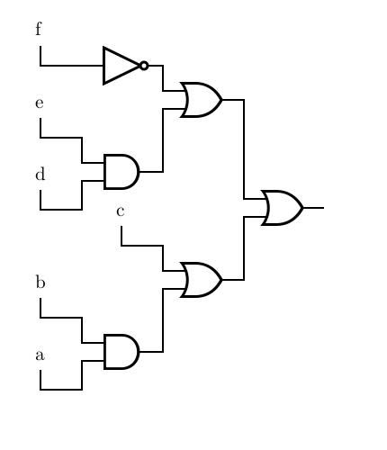

# LogicDiagramGenerator
Input: `(ab + c) + (de + f')`

Output: 



# Usage
Having built the program with `cargo build` or ran it with `cargo run`,
the program will read a boolean function from stdin.
Valid operators are `+` (OR), `*` (AND), `'` (NOT).

A few examples:
```
a + b'
```
Is equivalent to `A OR NOT B`

```
(ab') + c(d+e)
```
Is equivalent to `(A AND NOT B) OR (C AND (D OR E))`
(asterisks can be inferred in some places)

# Author's Notes
This was one of the harder programs I've ever written.
There were lots of sneaky problems lurking around corners with frying pans at the ready to whack you with.

The program starts by taking in the boolean function from stdin, converting it to a postfix expression and evaluating the postfix expression to create a binary tree. Each logic gate is a node in the tree whose inputs are its children.

This made it easy enough to see that the inputs for the variables (the parts labeled with letters in the figure) should be considered a gate as well, which turned out to be an exceptionally convienient trick. 
Drawing inputs and labeling them was almost no extra work.

What constituted the bulk of the trouble was figuring out
    1. How to draw the tree in the densest way possible without intersecting other elements, and
    2. How to figure out how big the finished circuit would be

Solving the first problem was prickly, and my solution still isn't perfect.
Because the diagram is a tree, and the heights of gates are relatively constant, so you could just space all of the nodes evenly so that the final row can fit 2^n gates. However, this can create hilariously ballooned graphs where the majority of the output is wasted space.

The solution I came to was to scale the spread of each successive branch so that the branch is raised by the height of its greatest column.
You can see this in the example output at the top of the README.
If you look at how the circuit branches left, in the top half of the figure,
the f' gate is raised much less than the E*D gate, because the f' gate has height 1, and the E*D gate has to leave room for both the E and D input gates to exist.

This approach works well for diagrams that are relatively balanced, but if one branch is many levels deeper than another, and one of those deeper levels is quite tall, it's possible that the tall level could exist to the left of every other gate, and you don't actually need to adjust its position at all because there aren't any gates above it, but the program isn't smart enough to figure that out (maybe it's the programmer, not the program).

The second problem proved less difficult, but more unsatisfying.
Calculating the height of the diagram was tricky because there is no clean formula for it. If it was an evenly spaced binary tree with n levels, then `2^n * (height of gate)` would give us the height of the image, however it's not the case that every gate is evenly spaced, and given the solution to spacing the gates it's not easy to pre-compute how tall the the figure should be.

I ended up just prentending to draw the tree, which is O(N) but N is rather small, and while drawing kept track of the largest and smallest y value that we drew a gate at.

Just subtracting those numbers gives the height of the figure, and you can also use that information to center the figure too.

Initially I placed the output gate in the center of the image always, but that doesn't make a lot of sense for a function like `a+b+c+d+e+f+g`. which produces a diagram that looks like a descending staircase.

Because the height of the diagram was calculated by pretending to draw the circuit, and the output gate is always in the center of the image, the program could just find where the middle of the diagram is by averaging the minimum and maximum y value, and translating the graph so that the middle of the diagram ended up whereever the output gate was initially drawn, which creates a nicely centered output graph.